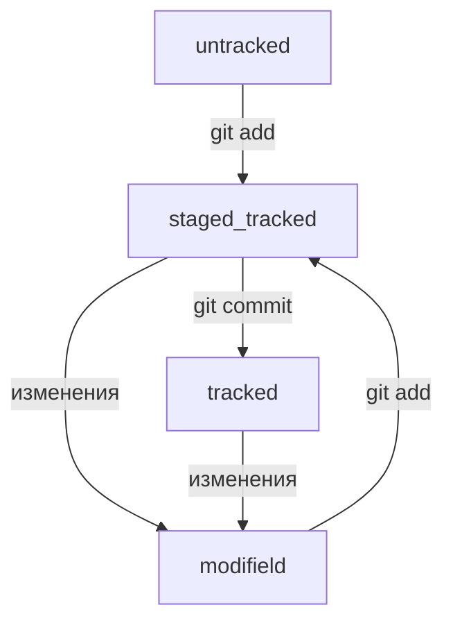

# Курс по основам GIT от Yandex  Практикум

### Данный проект создан в качестве подсобного учебного материала по изучению основ работы с GIT. Проект является исключительно учебным и выполнен в форме конспекта. В проекте отражены основыые тезисы и вехи пройденного материала

### Проект создан в личных целях, для использования его в дальнейшем обучении программированию

### Вы можете свободно использовать изложенный ниже материал в своих целях

# Работа с командной строкой

1. Основные команды терминала:

* `$ pwd` - показать рабочую папку;
* `$ cd` - смена директории;
* `$ cd~` - перейти в домашнюю директорию;
* `$ cd..` - вернуться на уровень выше;
* `$ ls -a` - вывести содержимое директории, включая скрытые файлы;
* `$ ls ~` - вывести содержимое домашней директории;
* `$ ls ..` - вывести содержимое родительской директории.

2. Работа с директориями и файлами:

* `$ touch` - создать файл (необходимо указывать расширение);
* `$ mkdir` - создать директорию;
* `$ mkdir -p` - создать структуру директорий;
* `$ mkdir ~` - создать директорию в домашней директории;
* `$ mkdir ..` - создать директорию в родительской директории;
* `$ cp` - копирование файлов (cp что копируем куда);
* `$ mv` - перемещение файлов (mv что переносим куда);
* `$ cat` - прочитать файл в терминале (работает только для txt);
* `$ rm` - удалить файл;
* `$ rmdir` - удалить директорию;
* `$ rm -r` - удалить директорию со всем ее содержимым.
* `chmod +x check.sh` - эта команда сделает файл *check.sh* исполняемым
* `./check.sh` - эта команда исполнит скрипт

3. Полезные команды:

* `$ &&` - выполнить несколько команд (используется как разделитель команд);
* `$ /` - переместиться в корневую директорию;
* `$ ~` - переместиться в домашнюю директорию.

4. Сведения, информация:

* `$ top` - посмотреть запущенные процессы на машине
* `$ free -h` - посмотреть оперативную память
* `# ifconfig` - посмотреть все сетевые интерфейсы
* `# nslookup` - зарезолвить какой-либо адрес в ip-адрес (`# nslookup python.org`)
* `# telnet` - посмотреть открыт или закрыт какой-либо порт на сервере (`# telnet python.org 80`)
* `# nmap` - посмотреть открытые порты у сервера (`# nmap python.org`)
* `$ uname -r` - посмотреть версию linux
* `$ uname -a` - посмотреть версию linux
* `$ df` - информация о дисках
* `$ sudo su` - перейти в режим от root

# Работа с git

## Работа с локальным репозиторием GIT

1. Создание репозитория.

- Создать git-репозиторий, выполнить внутри папки проекта:
```bash
git init
```

- Что бы "разгитить" папку в которой git-репозиторий больше не нужен:
```bash
rm -rf .git
```

- Проверить состояние репозитория:
```bash
git status
```

2. Добавить файлы в репозиторий.

- Подготовить к сохранению все файлы репозитория (добавить файлы):
```bash
git add -all
```

- Добавить файлы в репозиторий по одному:
```bash
git add todo.txt
git add readme.txt
```

- Добавить в репозиторий всю текущую папку:
```bash
git add .
```

3. Выполняем коммиты.

- Выполнить коммит:
```bash
git commit -m "в кавычках указываем комментарий"
```

- Просмотреть историю коммитов:
```bash
git log
```

## Работа с удаленным репозиторием GIT

1. Связать локальный с удаленным репозиторием (привязать удаленный репозиторий к локальному):
```bash
git remote add origin "в кавычках указываем SSH-ключ"
```

2. Посмотреть (проверить), что репозитории связаны:
```bash
git remote -v
```
где: флаг **-v**  это короткая форма записи от --verbos (подробный)

3. Отправить изменения в удаленный репозиторий:
```bash
git push -u origin master
```
где *master* название основной ветки, так же возможно использовать *main*. Флаг *-u* это связка веток удаленного и локального репозитория. При последующих пушах фалаг *-u* можно опускать.

## Файл *README.md*

 Файл *README.md* служит для описания созданного проекта, который был запушен в удаленный *GIT-репозиторий*. Данный файл создается для сторонних участников проекта или сторонних разработчиков, что бы дать описание проекту. Что необходимо описать:

1. Название проекта и его кроткое описание, кем создан, для чего, какие решает задачи и проблемы;

2. Технологии которые применяются в проекте. В чем его отличие от аналогичных проектов.

3. Документация проекта - подробная инструкция о том, что представляет собой проект.

4. Планы проекта, если таковые есть.

Для оформления файла *README.md* используется специальный язык разметки - *Markdown*

---

1. Заголовки разных уровней создаются символом - *# - решетка*:

```text
# - H1 - заголовок первого уровня,
```

```text
## - H2 - заголовок второго уровня,
```

```text
### - H3 - заголовок третьего уровня,
```

```text
#### - H4 - заголовок четвертого уровня,
```

```text
##### - H5 - заголовок пятого уровня,
```

```text
###### - H6 - заголовок шестого уровня.
```

2. Чтобы создать черту под заголовком или абзацем используют три тире:

```text
---
```

3. Чтобы сделать разрыв строки, нужно поставить два пробела в конце строки.

4. Чтобы начть новый параграф нужно нажать Enter два раза.

5. Выделение текста:

- Чтобы выделить текст курсивом необходимо текст заключить в символы "звездочка" в начале и в конце текста:

```text
*текст*
```

либо заключить текст в символах "нижнее подчеркивание":

```text
_текст_
```

- Чтобы выделить текст полужирным шрифтом необходимо его заключить в двойные "Звездочки" либо в двойные "нижние подчеркивания":

```text
**текст**
```

либо

```text
__текст__
```

- Зачеркнутый текст заключают в двойных знаках тильда (~)

```text
~~текст~~
```

### Оформление списков
---

1. Нумерованные списки. Данные списки формляются написанием номера по порядку с точкой после цифры:

```bash
1.
```

```bash
2.
```

и т.д.

2. Не нумерованные списки оформляются с помощью символа "звездочка" в начале или с помощью символа "тире (минус)":

```bash
* какой-то текст
```

или

```bash
- какой-то текст
```

### Оформление ссылок
---

Для оформления текста как ссылки, сам текст должен быть указан в квадратных скобках, а затем, без пробела, в круглых скобках указывается ссылка на рессурс. Тайтл (всплывающая подсказка) сслыки указывается в кавычках, сразу после ссылки на рессурс.

```bash
[яндекс](https://www.yandex.ru "Я яндекс")
```

### Оформление кода
---

Для оформления кода используются специальные символы - граверсы, записанные три раза в начале и три раза в конце нужного кода.

```text
(```)
```

Причем три граверса, указываемых в конце - записываются на новой строке.

```text
``` bash
ls -la```
```

```html
```html
<h1> А я просто текст  </h1>```
```

## Хеш - идентификатор коммита

Хеш можно посмотреть при выводе истории коммитов командой
```bash
git log
```

Хеширование (от англ. *рубить*, *крошить*) это способ преобразовать набор данных и получить их *отпечаток*.
Информация о коммите - это набор данных: когда был сделан коммит, содержимое файлов в репозитории на момент коммита и ссылка не предыдуший, или **родительский** коммит.

Git хеширует (преобразует) информацию о коммите с помощью алгоритма SHA-1 (Secure Hash Algorithm - *безопасный алгоритм хеширования* и) получается для каждого коммита свой уникальный **хеш** - результа хеширования.

Обычно Хеш - это короткая (40 символов в случае SHA-1) строка, которая состоит из цифр 0-9 и латинских букв A-F (неважно заглавных или строчных). Она обладает следующими важными свойствами:

* если хеш получить дважды для одного и того же набора входних данных, то результат будет гарантированно одинаковый;

* если хоть что-то в исходных данных поменяется (хотя бы один символ), то хеш тоже изменится (причем сильно).

Git хранит таблицу соответствий *хеш -> информация о коммите*. Если знать хеш, можно узнать все остальное: автора и дату коммита и содержимое закомиченных файлов.  Хеш - основной идентификатор коммита.

Хеши можно передавать в качестве параметра разным Git-командам, чтобы указать, с каким коммитом нужно произвести действие.

Все хеши и таблицу *хеш -> информация о коммите* Git сохраняет в служебные файлы. Они находятся в папке *.git* в репозитории проекта.

## Исследуем лог. Элементы написания коммита

После вызова *git log* появляется список коммитов.

```bash
$ git log
commit e007f5035f113f9abca78fe2149c593959da5eb7 (HEAD -> master) --- 1
Autor: John Doe <johndoe@example.com> --- 2
Date: Tue Mar 28 00:26:53 2023 +0333 --- 3

  Добавить амбиций в список дел --- 4
```

Где:

`1 - хеш коммита`

`2 - имя автора и его эл.почта`

`3 - дата и время создания коммита`

`4 - сообщение коммита`

### Получить сокращенный лог

Получить согращенный лог можно командой:

```bash
git log --oneline
```

Команда `git log --oneline` выводит так же согращенных хеш, данная команда автоматически подбирает такую длину хешей, что бы они были уникальными в пределах репозитория.

Если выход из просмотра логов не произошел автоматически, жми клавишу **Q**

## HAED - всему голова

При вызове команды:

```bash
git log
```
можно заметить надпись `HEAD -> master` после хеша одного из коммитов.

## Файл HEAD

Файл HEAD (англ. головной) - служебный файл папки `.git`. Он указывает на коммит, который сделан последним (то есть на самый новый).

Открыть файл HEAD можно в терминале:

```bash
$ cd .git/ # переходим в папку git
$ ls # смотрим, какие файлв в данной папке
$ cat HAED # смотрим содержимое файла HAED
```

Внутри HEAD  - ссылка на служебный файл `refs/heads/master`. В данном файле можно увидеть хеш последнего коммита.

```bash
$ cat refs/heads/master # взяли ссылку из файла HEAD
# внутри хеш
e007f5035f113f9abca78fe2149c593959da5eb7

$ git log
# сверяем с хешем последнего коммита
commit e007f5035f113f9abca78fe2149c593959da5eb7
Author: John Doe <johndoe@example.com>
Date:   Tue Mar 28 00:26:53 2023 +0300

    Добавить амбиций в список дел

... # другие коммиты
```

Когда делается коммит, GIT обновляет файл `refs/heads/master` - записывает в него хеш последнего коммита. Получается, что HEAD тоже обновляется.

Если нужно передать последний коммит в качестве параметра в `git`, то вместо его хеша можно прото написать слово `HEAD`.

## Статусы файлов в GIT

Одна из ключевых задач Git — отслеживать изменения файлов в репозитории. Для этого каждый файл помечается каким-либо статусом.

* `untracked` - Новые файлы в Git-репозитории помечаются как *untracked*, то есть неотслеживаемые. Git «видит», что такой файл существует, но не следит за изменениями в нём. У untracked-файла нет предыдущих версий, зафиксированных в коммитах или через команду `git add`.

* `staged` - После выполнения команды `git add` файл попадает в *staging area* (от англ. stage — «сцена», «этап» и area — «область»), то есть в список файлов, которые войдут в коммит. В этот момент файл находится в состоянии *staged*.
*Staging area* также называют *index* (англ. «каталог») или *cache* (англ. «кеш»), а состояние файла *staged* иногда называют *indexed* или *cached*.

* `tracked` - Состояние *tracked* — это противоположность *untracked*. В него попадают файлы, которые уже были зафиксированы с помощью `git commit`, а также файлы, которые были добавлены в *staging area* командой `git add`. То есть все файлы, в которых Git так или иначе отслеживает изменения.

* `modified` - Состояние *modified* означает, что Git сравнил содержимое файла с последней сохранённой версией и нашёл отличия. Например, файл был закоммичен и после этого изменён.

## Про staged и modified

Команда `git add` добавляет в *staging* area только текущее содержимое файла. Если вы, например, сделаете `git add file.txt`, а затем измените *file.txt*, то новое содержимое файла не будет находиться в *staging*.
Git сообщит об этом с помощью статуса *modified*: файл изменён относительно той версии, которая уже в *staging*. Чтобы добавить в *staging* последнюю версию, нужно выполнить `git add file.txt` ещё раз.

## Типичный жизненный цикл файла в Git



1. Файл только что создали. Git про него ещё ничего не знает. Состояние: untracked.
2. Файл добавили в staging area с помощью `git add`. Состояние: staged (+ tracked).
* Возможно, изменили файл ещё раз. Состояния: staged, modified (+ tracked).
Обратите внимание: staged и modified у одного файла, но у разных его версий.
* Ещё раз выполнили `git add`. Состояние: staged (+ tracked).
3. Сделали коммит с помощью `git commit`. Состояние: tracked.
4. Изменили файл. Состояние: modified (+ tracked).
5. Снова добавили в staging area с помощью `git add`. Состояния: staged (+ tracked).
6. Сделали коммит. Состояния: tracked.
7. Повторили пункты 4−7 много-много раз.

Большинство файлов в проектах «шагает» по следующему циклу: «изменён» -> «добавлен в список на коммит» -> «закоммичен» -> «изменён» -> и так далее.

## Как читать git status

Проверять статусы файлов нужно командой:

```bash
git status
```

## Какие состояния показывает `git status`

Большинство файлов в типичном проекте будут находиться в состоянии tracked (то есть закоммичены и не изменены после коммита). Вы не увидите это состояние в выводе команды `git status`.

В итоге *git status* показывает только следующие состояния файлов:
* staged (Changes to be committed в выводе `git status`);
* modified (Changes not staged for commit);
* untracked (Untracked files).

Подготавливаем репозиторий

Чтобы попрактиковаться, инициализируйте новый репозиторий ~/dev/git-status-lesson. Создайте в нём файл README.md и закоммитьте его.

```bash
$ cd ~/dev
$ mkdir git-status-lesson
$ cd git-status-lesson
$ git init
# тут Git выведет что-нибудь, но мы это пропустим
$ touch README.md
$ git add README.md
$ git commit -m 'Добавить README'
# по традиции первым создадим и закоммитим файл README.md
```

Дальше вы будете добавлять в репозиторий файлы и смотреть на их статусы.

## Типичные варианты вывода `git status`

Рассмотрим четыре примера состояний, в которых может находиться ваш репозиторий.

1. Нет ни staged-, ни modified-, ни untracked-файлов.
Если ничего не менять в git-status-lesson после первого коммита, то в нём не должно быть ни изменённых файлов (modified), ни новых (untracked), ни добавленных в список на коммит (staged). Вызовите команду `git status`. Ее вывод будет примерно таким.

```bash
$ git status
On branch master
nothing to commit, working tree clean
```

Это означает, что в репозитории нет новых или изменённых файлов. Последняя строка `nothing to commit, working tree clean` буквально переводится как «нечего коммитить, рабочая директория чиста».
Первая строка `On branch master` сообщает, что текущая ветка — `master`.

2. Найдены неотслеживаемые файлы.
Создайте в папке `~/dev/git-status-lesson` файл *fileA.txt*. Теперь в репозитории есть новый файл в состоянии untracked. Снова вызовите команду `git status`. Результат будет таким.

```bash
$ touch fileA.txt
$ git status
On branch master
Untracked files: # найдены неотслеживаемые файлы
  (use "git add <file>..." to include in what will be committed)
        fileA.txt

nothing added to commit but untracked files present (use "git add" to track)
```

Файл fileA.txt отображается в секции неотслеживаемых файлов — Untracked files. Это значит, что он не был добавлен в репозиторий через `git add`.

Обратите внимание: в самом выводе *git status* есть подсказка, какую команду использовать, чтобы добавить файл в список на коммит: `Use git add <file> to include in what will be committed` (англ. «используйте git add <file>, чтобы добавить в список на коммит»).

Добавьте fileA.txt в staging area с помощью `git add` и снова запросите `git status`.

```bash
$ git add fileA.txt
$ git status
On branch master
Changes to be committed: # новая секция
  (use "git restore --staged <file>..." to unstage)
        new file:   fileA.txt
```

В этот раз `git status` подсказывает, что существует команда `git restore`. Мы познакомимся с ней дальше.

Теперь *fileA.txt* находится в секции *Changes to be committed* (англ. «изменения, которые попадут в коммит»). Если сейчас выполнить коммит, то в репозитории будет зафиксирована текущая версия этого файла. Закоммитьте его.

```bash
$ git commit -m 'Добавить файл fileA.txt'
# тут будет вывод комманды commit, он нас не интересует
$ git status
On branch master
nothing to commit, working tree clean
```

Вывод команды `git status` такой же, какой был после первого коммита: «Директория чиста».

3. Найдены изменения, которые не войдут в коммит
Теперь откройте файл fileA.txt и добавьте в него несколько слов — например, Это файл A!. Сохраните fileA.txt и вызовите команду `git status`. Её результат будет такой.

```bash
# внесли в fileA.txt правки
# запросили статус
$ git status
On branch master
Changes not staged for commit: # ещё одна секция
  (use "git add <file>..." to update what will be committed)
  (use "git restore <file>..." to discard changes in working directory)
        modified:   fileA.txt
```

Файл fileA.txt был изменён, но ещё не добавлен в *staging area* после этого. Так он оказался в секции *Changes not staged for commit* (англ. «изменения, которые не подготовлены к коммиту»). Эта секция соответствует статусу *modified*.
Подготовьте правки к коммиту с помощью `git add`.

```bash
$ git add fileA.txt
$ git status
On branch master
Changes to be committed: # все изменения готовы к коммиту
  (use "git restore --staged <file>..." to unstage)
        modified:   fileA.txt
```

Теперь в коммит попадёт уже новая версия файла fileA.txt.

Обратите внимание: хотя вывод команды `git status` очень похож на тот, который был после первого добавления файла fileA.txt, они всё же отличаются.
Когда совсем новый файл попадает в *staging area*, перед его названием указывается *new file*. Вот так: `new file: fileA.txt`.

Если файл уже однажды попадал в историю (с помощью коммита) и был изменён, после выполнения `git add` он будет записан уже так: `modified: fileA.txt`.

4. Файл добавлен в *staging area*, но после этого изменён.
Вы добавили файл в *staging area*, но перед самым коммитом вспомнили важную мелочь. Например, вместо одного восклицательного знака в конце строки Это файл A! нужно поставить три.
Откройте текстовый редактор и добавьте нужные правки. Теперь можно выполнить коммит, но в любой непонятной ситуации сначала стоит вызвать `git status`. Он покажет следующее.

```bash
# изменили fileA.txt
$ git status
On branch master
Changes to be committed:
  (use "git restore --staged <file>..." to unstage)
          modified:   fileA.txt

Changes not staged for commit:
  (use "git add <file>..." to update what will be committed)
  (use "git restore <file>..." to discard changes in working directory)
          modified:   fileA.txt
```

Файл попал и в *staged* (Changes to be committed), и в *modified* (Changes not staged for commit). В *staging area* находится версия файла с одним восклицательным знаком, а в *Changes not staged for commit* — уже изменённая версия, с тремя.
Чтобы закоммитить самую свежую версию файла, нужно снова выполнить `git add` перед коммитом.

## Оформление сообщений к коммитам

То, как написаны сообщения коммитов, тоже может подчиняться определённым правилам. Иногда эти правила продиктованы культурой команды, а иногда техническими ограничениями.
Например, в выводе команды `git log --oneline` умещается максимум 72 первых символа сообщения, поэтому многие правила включают пункт: «Сообщение не должно быть длиннее 72 символов».

## Зачем вообще писать сообщения

У каждого коммита в Git есть сообщение — то, что передаётся после параметра *-m*. Например: `git commit -m "Добавить урок про оформление сообщений коммитов"`.
Сообщения коммитов можно сравнить с надписями на коробках в кладовке. Если надписей нет, то нужную коробку будет сложно найти: придётся заглянуть в каждую, чтобы понять, что там. А если надписи есть, то нужная найдётся сразу.

Есть общие рекомендации по тому, как правильно составить сообщение. Оно должно быть:

* относительно коротким, чтобы его было легко прочитать;
* информативным.

Вот пример полезного сообщения в репозитории новостного сайта: "Исправление опечатки в заголовке главной страницы на хорватском".

Пример плохого сообщения для того же коммита: "Исправлена опечатка".

## Стили оформления

Все люди разные и у всех есть предпочтения — в том числе, как формулировать сообщения коммитов. Кто-то использует инфинитивы: "Исправить сообщение об ошибке E123", кто-то — глаголы в прошедшем времени: "Исправил…", кто-то — существительные: "Исправление…".

Чтобы упростить работу, команды и часто договариваются об определённом стиле (то есть о правилах) оформления сообщений коммитов.
Например, правила могут быть такие:

* длина сообщения от 30 до 72 символов;
* первое слово — глагол в инфинитиве («исправить», «дополнить», «добавить» и другие);
* и так далее.

Есть много подходов к оформлению сообщений коммитов, но мы расскажем о нескольких популярных. Их используют как отдельные команды, так и целые проекты.

### Корпоративный

Во многих компаниях применяется *Jira* — система для организации проектов и задач. У каждой задачи в *Jira* есть идентификатор из нескольких заглавных латинских букв и номера. Например, LGS-239 значит, что это это $239$-я задача в проекте LGS (сокращение от англ. logistics — «логистика»).
В корпоративном стиле в начале сообщения обычно указывают Jira-ID, а после — текст сообщения.

```bash
$ git commit -m "LGS-239: Дополнить список пасхалок новыми числами"
```

### Conventional Commits

*Conventional Commits* предлагает такой формат коммита: <type>: <сообщение>. Первая часть type — это тип изменений. Таких типов достаточно много. Вот два примера:

* feat (англ. «навык») — для новой функциональности;
* fix (от англ. «исправить», «устранить») — для исправленных ошибок.

Более подробный список можно увидеть на [сайте с описанием этого стиля](https://www.conventionalcommits.org/ru/v1.0.0-beta.4/#%D1%81%D0%BF%D0%B5%D1%86%D0%B8%D1%84%D0%B8%D0%BA%D0%B0%D1%86%D0%B8%D1%8F)

### GitHub-стиль

Гит-хаб можно использовать для ведения списка задач (issue). Если коммит решает какую-то задачу, то в сообщении нужно указать номер этой задачи. #<номер задачи>.

Например, сообщение может быть таким:

```bash
$ git commit -m "Исправить #334, добавить график температуры"
```

В таком случае GitHub свяжет коммит и задачу.

### Инфинитив и императив

Для сообщений на русском языке часто рекомендуют использовать инфинитивы. Например: "Добавить тесты для PipkaService", "Исправить ошибку #123" и так далее.
Для сообщений на английском рекомендуется использовать повелительное наклонение (англ. imperative). Например: "Use library mega_lib_300", "Fix exit button" и так далее.
Эти рекомендации сложились исторически, и им следуют многие проекты.

##  Как исправить коммит

```bash
git commit --amend
```

`git commit --amend --no-edit` - для внесения исправлений в последний коммит не меняя сообщение, где:

`--no-edit` - сообщение команде *commit*, что сообщение коммита нужно оставить преждним.

## Изменить сообщение коммита

```bash
git commit --amend -m "новое сообщение"
```

Если забыть указать флаг `--no-edit` или флаг `-m`, откроется редактор NANO или VIM.

## Как откатиться назад если все "сломалось"

### Как откатить нежелательные изменения

Если был создан файл или изменен файл и он был дабавлен в *staging area* через `git add`, но его не нужно было включать, то убрать файл из *staging* можно командой:

```bash
git restore --staged <имя файла>
```

эта команда переводит данный файл обратно в статус *untracked* или *modified*.

### Откатить коммит

```bash
git reset --hard <commit host>
```

в *commit host* нужно указать предпоследний коммит (его hesh), до которого нужно сброситься.

### Откатить изменений, которые не попали ни в *staging* ни в коммит

Если был случайно изменен файл, который не нужно было менять, что чтобы все вернуть нужно выполнить:

```bash
git restore <имя файла>
```

данная команда откатит изменения в файле до последней сохраненной версии (в коммите или staging). Используется если нужно откатить изменения которые еще не попали ни в staging area, ни в коммит.

## Просматриваем изменения в файлах

Иногда нужно проверить, что может измениться или уже изменилось после того или иного коммита.

- Собираемся коммитить и хотим узнать какие именно изменения в него попадут.
- Посмотреть что было изменено в коммите.

```bash
git diff # от английского difference (отличие)
```

эта команда сравнит последнюю закоммиченную  версию с текущей измененной.
git выведет `@@ -1, 2  +1, 2 @@`, где -1 и 2 это строки, попавщие  в ставнение (2 строки начиная с 1), 15, 7 (это 7 строк начиная с 15-й).

`git diff` сравнивает последнюю закоммиченную версию файла с той которая находится в *modified, но не показывает изменения в *staged* (после `git add`)

`git diff --staged` покажет изменения в *staged* относительно последних закоммиченных версий.

## Сопоставляем коммиты

Команда `echo` - (от английского "Эхо")

Внесение строк в файл *txt*:

```bash
cat file.txt
Первая строка файла
echo "Вторая строка файла" >> file.txt
```
Оператор `>>` - перенаправление ввода.
Оператор `>` - тоже перенаправление ввода, но существующее содержимое файла будет стерто.

или так:

```bash
cat file.txt
Первая строка файла
Вторая строка файла
```

Можно сравнивать изменения в файле между хешами

```bash
git diff <более ранний хеш> <более поздний хеш>
```

Можно посмотреть историю изменнеий наоборот:

```bash
git diff <самый поздний хеш> <более ранний хеш>
```

## Игнорирование файлов в git

Что бы git игнорировал ненужные для коммитов файлы нужно создать файл `.gitignore` и записать в него список игнорироуемых файлов.

### Как заполнить файл `.gitignore`

Правила файла `.gitignore` применяются только к untraked-файлам (не отслеживаемым).

- `#` - симвод для комментариев
- `.DS-Store` - запись для игнорирования файла *DS-Store*
- `*` - символ "звездочки" соответствует любой строке, включая пустую
- `*.jpeg` - игнорировать файлы с расширением *.jpeg*
- `docs/*/tmp` - игнорировать файлы *tmp* во всех подкаталогах каталога *docs*
- `file?.txt` - "вопросительный знак" соответствует одному любому символу
- `[...]` - "квадратные скобки" соответствуютодному символу, который указан в скобках. Например при записи `file[0-2].txt` - будут игнорированны файлы *file0.txt*, *file1.txt*, *file2.txt*
- `/` - "слеш" указывает на каталог
- `/todo.txt` - игнорировать файл *todo.txt* в корне проекта
- `spam.txt` - игнорированть файлы *spam.txt* во всех каталогах проекта
- `build/` - игнорировать папку *build* и все ее содержимое
- `**` - парные "звездочки" - игнорирование любого количества вложеных папок, включая ноль папок, только не одной
- `!` - "восклицательный знак" - инверсия правил
- Игнорирование файлов *.jpeg* кроме одного файла *doge.jpeg*

```bash
*.jpeg
!doge.jpeg
```

`git status` - не выводит игнорируемые файлы, для вывода есть ключ `--ignored`

Чтобы посмотреть игнорируемые файлы:

```bash
git status --ignored
```

## Клонировать репозиторий на свой компьютер (*clone*)

```bash
git clone <адрес репозитория или ключ SSH>
```

Проверить связь с удаленным репозиторием:

```bash
git remote -v
```

## Клонировать репозиторий на свой аккаунт GitHub (*Fork*)

Для использования чужого проекта из GitHub можно выполнить копирование проекта прямо на свой аккаунт на сервере GitHub.

Требуемые действия:

1. Переходим в репозиторий с чужим проектом и нажимаем кнопку *Fork*
2. В открывшемся окне можно поменять название репозитория, поставив галочку. Чтобы скопировать только главную ветку нужно нажать кнопку *Create fork*
3. Далее выполнить `git clone <адрес репозитория или ключ SSH>`
4. Вносим изменения в проект
5. Делаем коммит
6. Отправляем изменения в удаленный репозиторий `git push origin master`

## Ветки *branch*

Ветки это изолированный поток разработки проекта.

Оснавная, стабильная версия проекта хранится на ветке *main*

* Посмотреть ветки проекта:

```bash
git branch
```

* Создать ветку:

```bash
git branch <название ветки>
```

Название ветки может состоять из букв, цифр, а также включать символы `.` `-` `_` `/`

* Создать ветку и сразу переключиться в нее:

```bash
git checkaut -b <название ветки>
```

Ветка в Git это указатель на коммит

* Сравнить ветки:

```bash
git diff <название ветки 1> <название ветки 2>
```

Данная команда покажет изменения в "рабочей зоне", т.е. в modified-файлах

* Навигация, cуфикс навигации `~`

`~N` - где N это число, отсчитывающее от заданного коммита N коммитов назад во времени. Нумерация начинается с `0`


`commit~0` - это сам коммит

`commit~1` - это предыдущий коммит

`commit~2`- это предыдущий коммит предыдущему и т.д.

`HEAD~1` # это следующий коммит за текущим

Например:

```bash
git diff HEAD~1 HEAD # где HEAD~1 - предыдущий коммит, HEAD - текущий коммит. Покажет изменения от HEAD~1 к HEAD

git diff master master~2 # где master - HEAD, master~2 - второй коммит от текущего HEAD

git diff HEAD HEAD~1 # Покажет изменения от HEAD к HEAD~1
```

### Слияние веток *merge* (от англ. *сливать*)

* Выполнить слияние:

```bash
git merge <название ветки>
```

Эта команда объединит текущую ветку с указанной

* Удалить ветку после объединения:

```bash
git branch -D <название ветки>
```

* Удалить ветку после объединения, более безопасная команда:

```bash
git branch -d <название ветки>
```

Данная команда удалит ветку только если она была полностью объединена с другой

Удаление локальной ветки через git не удаляет ее на GitHub

### Конфликт

Если несколько членов команды решили поменять один и тотже файл и один из них влил изменения в ветку main, то в терминале будет ошибка при попытке влить в main тот же файл из другой ветки.

**Конфликт** это ситуация в которой одит или несколько человек модифицировали один и тот же файл.

Во время слияния Git сам подсвечивает файлы, которые не смог объединить.

**Рекомендации, что делать при конфликте:**

1. Открыть файл где произошел конфликт
2. Изучить обе стороны конфликта - вашу версию и версию колеги. Задача - правильно собрать две версии в итоговую
3. Вручную подправить или удалить неактуальные изменения, если они есть
4. Подготовить изменения к сохранению и сделать коммит

Как правило изменния сначала вливают  в новую ветку и лишь потом вливают эту ветку в основную.

### Отправить локальную ветку в удаленный репозиторий

1. Создть новую ветку

```bash
git branch <новая ветка>
```

2. Подключиться к удаленному репозиторию

```bash
git remote add origin <ключ SSH>
```

3. Запушить ветку

```bash
git push -u origin <имя ветки>
```

### Создать pull request (от англ. "запрос на изменения")

В процесе работы нельзя внести правки в своей ветке и сразу же залить ее в основную. Сначала коллеги должны убедиться, что предложенные изменения логичны и эффективны.

**Алгоритм правильного создания pull request:**

1. Пишем код в своей ветке
2. Создаем pull request
3. Коллеки проверяют и осталяют свои комментарии, это называется code-review (ревью кода)
4. После финального согласования заливаем свою ветку в основную

После того как новая ветка "Запушена" в удаленный репозиторий, можно делать pull request

1. Заходим на GitHub и жмем кнопку "Pull request", далее жмем "New pull request"
2. Выбираем ветки "откуда" и "куда" будет осуществляться pull request
3. Заполнием поля с название и описанием пулл-реквеста и жмем "Create pull request"
4. Переходим на вкладку "Files changed", чтобы оставить комментарий
5. По окончанию ревью можно посмотреть комментарии, на вкладке **pull request** обсудить изменения. Можно добавить новые коммиты в ветку, они автоматически попадут в пулл-реквест после "пуша"
6. Жмем "Merge pull request" - это объединит ветку  с изменениями в ветку master

### Забираем изменения из удаленного репозитория

Забрать изменения, сделанные коллегой себе на компьютер:

1. Заходим в проект, переходим в правильную ветку, обычно это *master*
2. Вводим команды, алгоритм следующий:

```bash
git checout main (master)

git pull

git checkout my-branch # вернуться в рабочую ветку

git merge main # влили main в новую ветку my-branch

git push -u origin my-branch # отправили ветку my-branch в удаленный репозиторий

git pull && git checkout <имя ветки> && git merge main
```

## Что такое *fast-forward*

Состояние *fast-forward* это:
- При слиянии двух веток никак не возможен конфликт;
- Истории этих веток не разошлись;
- Одна ветка является продолжением другой.

```
            C1  C2  C3  C4
main:     --*---*---*---*------------->
                         \  N1  N2
add-docs:                 --*---*----->

* - коммит
\ - связь
/ - слияние
```

Вливаем ветку *add-docs* в *main*, при этом все коммиты из *add-docs* можно просто положить в main и они выстроятся за уже сущенствующими.

- В результате  слияния git выведет строку `Fast-forvard`
- В истории коммитов HEAD будет указывать одновременно  и на main и на add-docs.

```
           C1  C2  C3  C4  N1  N2
main:    --*---*---*---*---*---*---->
```

 git добавил коммиты из *add-docs* в ветку *main*, или перемотал *main* вперед до состояния *add-docs*.

### Можно ли отключать *Fast-forward*

*Fast-forward* можно отключить флагом `--no-ff`, например:

```bash
git merge --no-ff add-docs
```

тогда вместо перемотки Git создаст коммит слияния (*merge commit*).

### Флаг `--graff`

```bash
git  log --graff

git  log --graff --oneline
```

Результат будет таким:

```
                                  merge-
           C1  C2  C3  C4         коммит
main:    --*---*---*---*------------*----------->
                        \  N1  N2  /
add-docs:                --*---*--
```

Это полноценный коммит слияния, он сохраняет всю информацию, в нем будет указано какая именно ветка влилась в main.

**Если история двух веток не разошлись и их коммиты выстаиваются в одну цепочку, эти ветки можно объединить в режиме *fast-forward***

### Состояние *Non-fast-forward*

Если коммиты двух веток разошлись - их коммиты не выстроить в одну линию.

Команда `git log` может выводить несколько веток:

```bash
git log --graph --oneline main add-docs
```

```
                           ___
           C1  C2  C3  C4 |C5 |
main:    --*---*---*---*--|-*-|---------->
                        \ | N1|  N2
add-docs:                -|-*-|--*------->
                          |___|
                         конфликт
```

если замержить:

```bash
git merge --no-edit add-docs
```

то получим:

```
                                  merge-
           C1  C2  C3  C4  C5     коммит
main:    --*---*---*---*---*--------*---->
                        \  N1  N2  /
add-docs:                --*---*--
```

Если истории двух веток разошлись, то при слиянии веток Git создаст коммит слияния.

При объединении веток в состоянии Non-Fast-forward возможны (но не обязательны) конфликты. Если конфликты всеже возмжоны, то Git попытается их разрешить сам или попросит вас сделать это вручную.

### `git push` и состояние *fast-forward*

`git push` тесно связан с состоянимем *fast-forward*. Для `git push` важно состояние *fast-forward* между локальной веткой и удаленной.

```
локальный   C1  C2  C3  C4       | удаленный   C1  C2
    main: --*---*---*---*---->   |     main: --*---*------------>
                                 |
                        выполняем git push
                                 |
локальный   C1  C2  C3  C4       | удаленный   C1  C2  C3  C4
    main: --*---*---*---*---->   |     main: --*---*---*---*---->
                                 |
                           или будет так

                               C1  C2
удаленный main: ---------------*---*---------------------------->
                                    \  C3  C4
локальный main:                      --*---*-------------------->

```

### `git push` и состояние *не-fast-forward*

Состояние:

```
                               C1  C2  D
удаленный main: ---------------*---*---*----------------------->
                                    \  C3  C4
локальный main:                      --*---*------------------->
```

Если попытаться сделать `git push`, то git выведет ошибку *"rejected"* (запрос отклонен). Что можно сделать:

1. Преобразование *rebase*. Эта операция позволяе изменить точку (коммит), от которой отделилась ветка

```
               C1  C2  D
---------------*---*---*----------------------->
                    \  C3  C4
                     --*---*------------------->
делаем rebase
               C1  C2  D
---------------*---*---*----------------------->
                        \  C3  C4
                          --*---*---------------->
```

у такого шага могут быть последствия:

- могут возникнуть конфликты между изменениями, как при слиянии веток;
- если действовать "не аккуратно" можно сломать репозиторий.

2. Форсированный пуш `git push --force` (от англ. сила)

```
               C1  C2  D
---------------*---*---*----------------------->
                    \  C3  C4
                     --*---*------------------->
делаем git push --force
               C1  C2  C3  C4
---------------*---*---*---*------------------->
```

Команда `git push --force` просто удалит коммит D. В очень редких случаях это уместная команда.

## Почему нельзя все пушить в *main*

Если нескольлко человек будут пушить коммиты в main, локальная ветка, main и ветка main на GitHub будут постоянно расходиться у других участников команды.

Чаще всего прямые пуши в main запрещены.

## Модели веток. Простая модель - feature branch

Основные правила:
- Новая функциональность или исправленная ветка
- Когда код в feature-ветке готов, он вливается в main
- В main всегда "рабочая" версия без "недоделок"

## Pul или merge request. Запрос на слияние

Названия "Пул-реквест" и "Мердж-реквест" означают одно и тоже. В GitHub принято называть "Пул-реквест" **PR**

На этапе PR можно сделать разные проверки:
- Запустить авто-тесты, которые покажут не "сломают" линовые изменения существующую логику работы.
- Посмотреть изменения глазами, это называется код-ревью (code-review)

**Ревью** выполняет сразу две функции:
1. Проверяет качество и необходимость предлагаемых изменений
2. Те кто выполняют ревью, узнают подробности о новых изменениях в проекте

Если ревьюероввсе устраивает они нажимают кнопку *Approve* (от англ. согласовать). Иногда вместо кнопки используется комментарий LGTM (Looks Good To Me)

После одобрения PR его автор (или другой участник проекта) может нажать кнопку *Merge*

### Жизненный цикл Pull-request:
1. Автор создает pull-requect
2. Ревьюэр просматривает изменения и предлагает правки, если они необходимы
3. Автор вносит исправления по комментариям ревьюэра
4. Второй и третий пункты могут повторяться
5. Если ревьюера все устраивает, он одобряет ("апрувит") пул-реквест
6. Теперь автор или ревьюэр могут влить изменения в основную ветку

### Работа с PR (soft skills)

### Ревью и его цель - улучшить проект

Конечная цель любого пул-реквеста - внести в проект полезные изменения
1. При обсуждении с PR стараться вносить конструктивные предложения, не стесняться задавать уточняющие вопросы или просить ссылки на примеры
2. Будь гибким. Одна из целей ревью - сделать код понятным и привести его к стандарту команды
3. Обращайте внимание как на совй стиль общения, так и на стиль общения других участников

Золотое правиль любого ревью это быть вежливым и действовать  из добрых побуждений

### Разрешение конфликта слияния

Выполним в командной строке

```bash
mkdir git-conflict
cd git-conflict
git init
echo 'main version' > readme.md
git add .
git commit -m 'main'
git checkout -b br1
echo 'version1' > readme.md
git add .
git commit -m 'v1'
git checkout master
git checkout -b br2
echo 'version2' > readme.md
git add .
git commit -m 'v2'
```
Получилось следующее:

```
            * br1
           /
----------*  main
           \
            * br2
```

Добавим в *master* ветку *br1*. Коммиты этих двух веток можно выстроить в одну линию , по этому слияние будет выполнено в режиме fast-forward.

```bash
git checkout master
git merge br1
```

```
-----*---* main, br1
      \
       --* br2
```
Попробуем объединить эти ветки:

```bash
git checkout master
git merge br2
```

И получаем конфликт

### Разрешаем конфликт вручную

Когда конфликт обнаружен Git помечает проблемные файлы и останавливаем процесс слияния

Посмотреть как Git пометил конфликт:
```bash
cat readme.md

# ответ будет примерно таким:

>>>>>>>>>> HEAD
version 1
===============
version 2
>>>>>>>>>> br2
```

Что бы разрешить конфликт вручную нужно открыть файл и выбрать какие изменения оставить, а какие нет. Для этого нужно удалить все маркеры и не нужные изменения. После чего подготовить изменения к сохранению и сделать коммит.

```bash
git add .
git commit --no-edit
```

Получим:

```
        br1
-----*---*---* master
      \ br2 /
       --*--
```

### Разрешаем конфликт через vimdiff

**Инструмент слияния (от англ. mergetool)**

- Конфликт это ситуация, в которой две ветки или более изменяют один и тот же файл в разных местах и пытаются объединиться в одну ветку
- При возникновении конфликта Git добавит в файлы маркеры конфликтов. Можно разрешить конфликты вручную: достаточно удалить маркеры и принять нжные изменения
- Для разрешения конфликтов также можно использовать vimdiff

### Разрешение конфликта через VS Code

После создания конфликта нужно открыть файл. В файле зеленым будет подсвечиваться текущая версия файла, а синим новые изменения

Появятся кнопки:
- "Принять текущие изменения" - разрешить конфликт через изменения, которые были раньше и удалить все остальное
- "Принять входящие изменения" - разрешить конфликт через изменения, которые внесли вы
- "Принять все изменения" - добавить оба изменения, одно за другим
- "Разрешить в редакторе слияния" - в редакторе выбираются нужные изменения и жмем "завершить слияние"

После выполненных действия нужно создать коммит через VS Code либо через Bash

Что бы отобразить в терминале граф:

```bash
git log --graph --oneline
```

### Если основная ветка убежала вперед во время ревью

Во время отправки своей ветки на ревью в main была влита другая ветка, со своими изменениями, соответственно main убежал вперед

```
Удаленная версия:

         --O    моя ветка
        /
-------O-------O------>  main
        \     /
         --O--  чужая ветка

Локальная версия:

        --O моя ветка
       /
------O main
```

Если свои изменения получиться смержить в новый main, то GitHub сможет самостоятельно разрешить конфликт. В это случая кнопка "Merge pull request" будет зеленой.

Если два изменения не могут существовать вместо, то GitHub выдаст предупреждение:
```
This branch has conflicts that must be resolved
```

На локальном компьютере можно разрешить конфликт в терминале:
1. Перейти в ветку main
2. Загрузить новые изменения в нее с помощью `git pull`. При этом  будет загружена и чужая ветка.
3. Перейти в свою ветку
4. Выполнить `git merge main` и разрешить конфликт локально. В результате будет создан коммит слияния

```
Удаленная копия:

         --O            моя ветка
        /
-------O-------O------> main
        \     /
         --O--          чужая ветка

Локальная копия:

        --O-----O----> моя ветка
       /       /
------O-------O------> main
       \     /
        --O--          чужая ветка
```

5. Отправить изменения из своей ветки в репозиторий командой `git push`. Так коммит попадет в удаленный репозиторий и в пул-реквест
---
[Ссылка на проект](https://github.com/EduardParfenov/git_from_yandex/tree/master "Проект git from yandex")